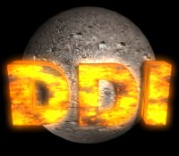



## Direct Draw Interface \(Game Engine\)

### Description

DDI is a Gaming Engine that allows Extremly easy access to DirectX. A full directX program created with DDI takes only 28 Lines!. Pictures and animations are assembled with DDIFileMaker and then loaded into the engine. The engine supports DirectDraw and DirectSound. Compile the DLL, register it with regserv32 and reference it with a new project! thats all there is to it!. (requires Dx7vb.dll)
 
### More Info
 

             |
---                |---
**Submitted On**   |2000-12-06 18:59:30
**By**             |[Michael Pot&\#232;](https://github.com/Planet-Source-Code/PSCIndex/blob/master/ByAuthor/michael-pot-232.md)
**Level**          |Advanced
**User Rating**    |4.9 (34 globes from 7 users)
**Compatibility**  |VB 4\.0 \(32\-bit\), VB 5\.0, VB 6\.0
**Category**       |[Games](https://github.com/Planet-Source-Code/PSCIndex/blob/master/ByCategory/games__1-38.md)
**World**          |[Visual Basic](https://github.com/Planet-Source-Code/PSCIndex/blob/master/ByWorld/visual-basic.md)
**Archive File**   |[CODE\_UPLOAD123991262000\.zip](https://github.com/Planet-Source-Code/michael-pot-232-direct-draw-interface-game-engine__1-13378/archive/master.zip)

